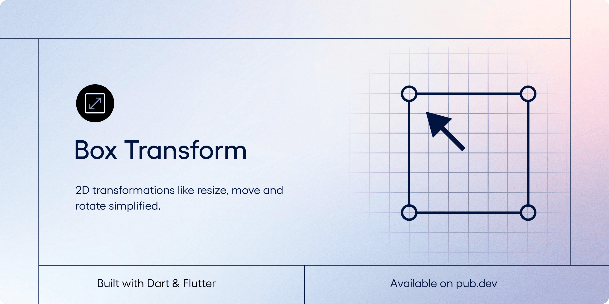

# Box Transform

[](https://github.com/invertase/melos) [](https://codemagic.io/apps/63dd4d4ae6be1d561b8f45d2/63dd4d4ae6be1d561b8f45d1/latest_build)

[Box Transform](github) is a pure-Dart base package that allows you to programmatically handle box resizing and dragging without relying on Flutter. It provides highly flexible, programmatically resizable and draggable boxes that can be used in any Dart project.
A library for advanced resizing of rect in UI.

```
TODO:
```

## Setting up project for development

This project uses melos to manage the monorepo. To get started, clone the repository and run the following commands:

1. Install melos. Make sure you have `.pub-cache/bin` in your path.

```bash
dart pub global activate melos
```

2. Setup the project with melos.

```bash
melos bootstrap
```

This will create dependency overrides for all the packages in the monorepo.

3. Run `pub get` with melos.

```bash
melos run deps
```

Now you can run the example app. See `melos.yaml` for more commands.

[github]: https://github.com/BirjuVachhani/rect_resizer
[pubdev]: https://pub.dev/packages/rect_resizer